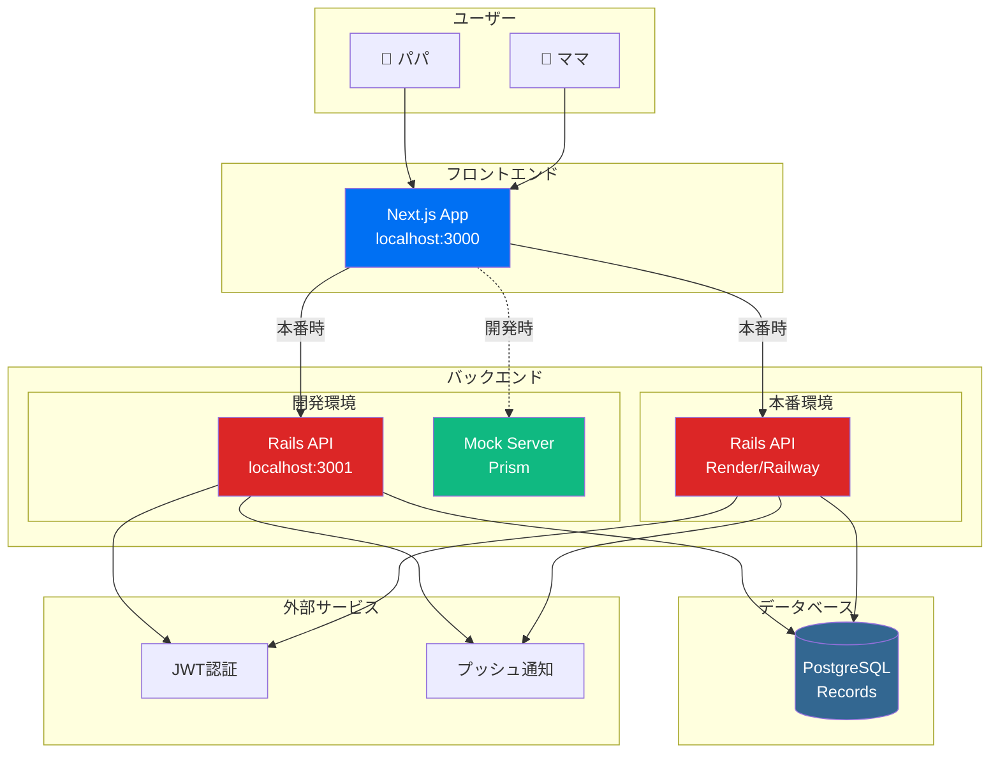
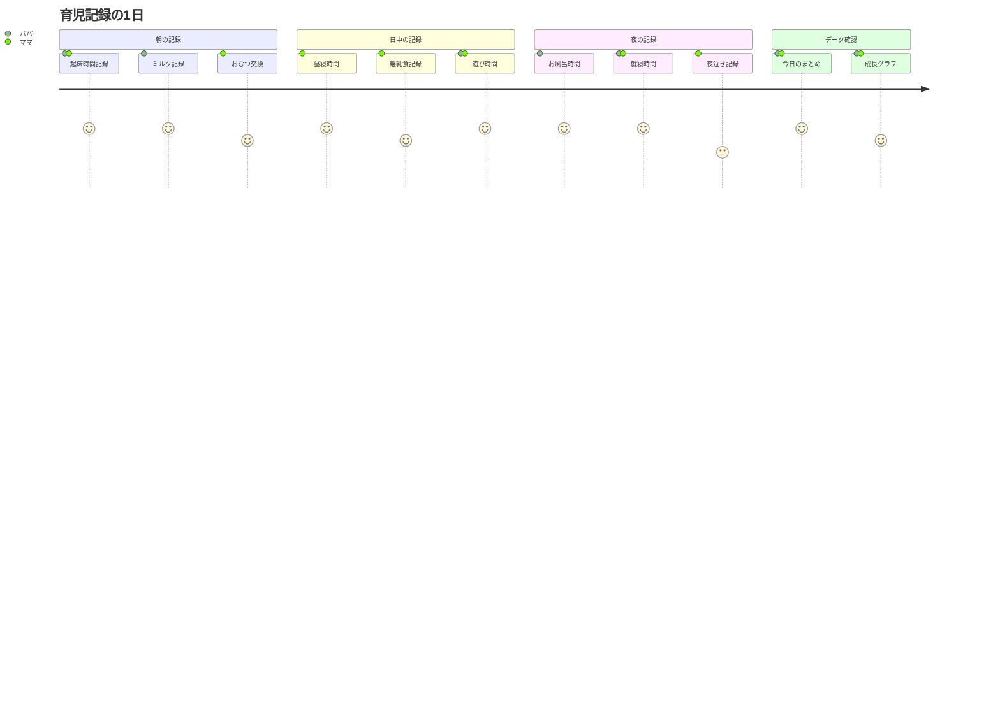
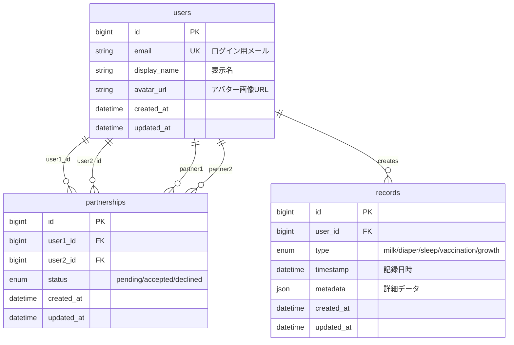
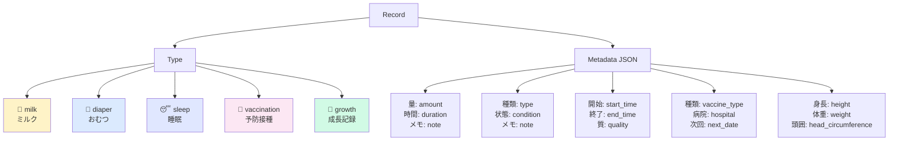
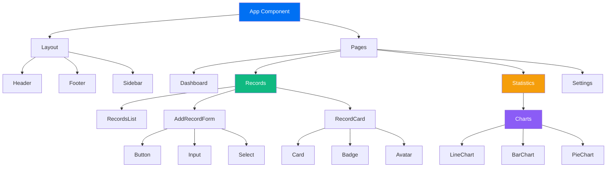
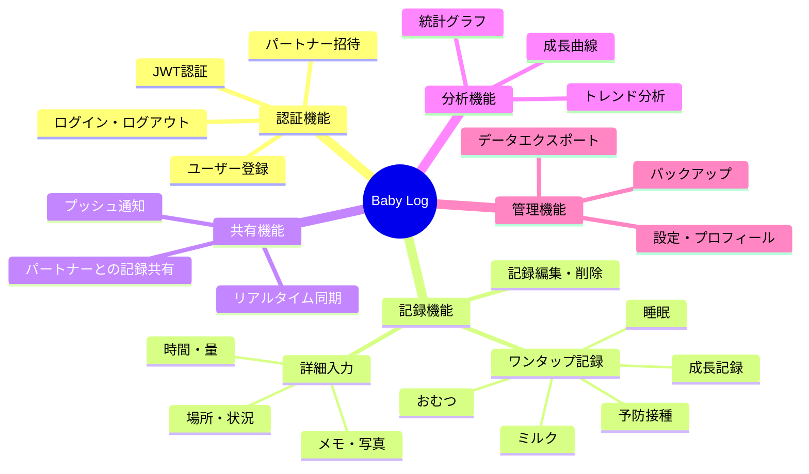
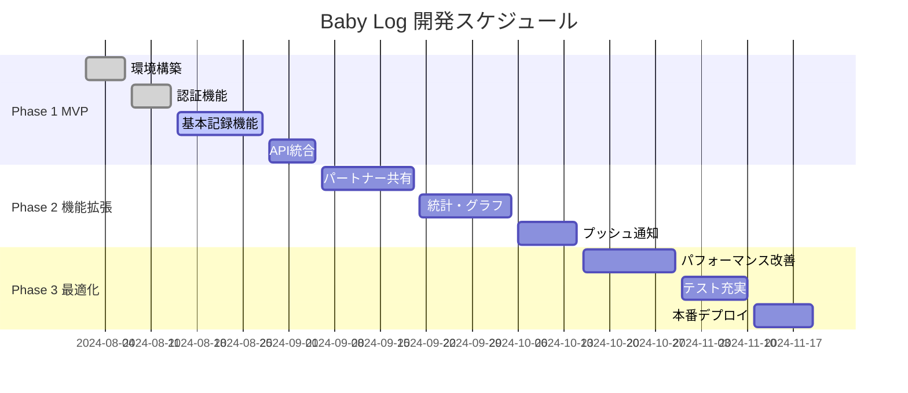
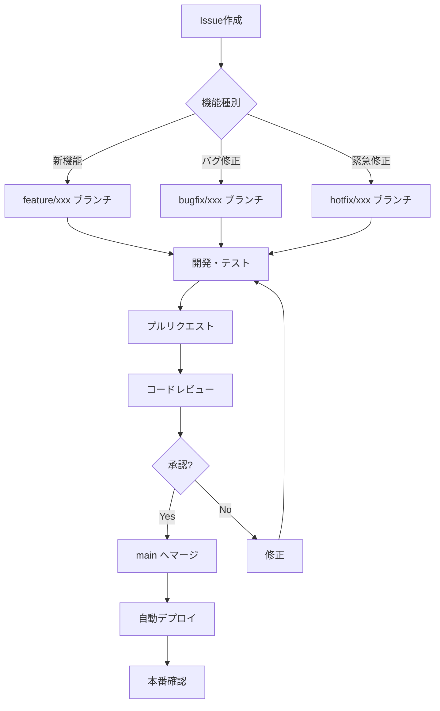

# Baby Log - 育児記録アプリ<br>夫婦間育児記録共有プラットフォーム

[](https://nextjs.org/)
[](https://rubyonrails.org/)
[](https://www.typescriptlang.org/)
[](./LICENSE)

夫婦間の育児記録をリアルタイムで共有し、育児の不安を解消するWebアプリケーション

## 📱 アプリ概要

Baby Logは、新生児から幼児期までの大切な成長記録を夫婦間で簡単に共有できるWebアプリケーションです。ワンタップで記録でき、パートナーとリアルタイムで情報を共有することで、育児の負担軽減と成長の見える化を実現します。

### 🎯 主な機能

- 🍼 **ワンタップ記録**: ミルク、おむつ、睡眠、予防接種などの簡単記録
- 👨‍👩‍👧‍👦 **パートナー共有**: 夫婦間でのリアルタイム記録共有
- 📊 **成長の見える化**: 日別・週別・月別の統計とグラフ表示
- 📅 **今日のまとめ**: その日の記録をダッシュボードで一覧表示
- 🔔 **記録通知**: パートナーの記録更新を即座に通知
- 📝 **詳細記録**: 量、時間、メモなどの詳細情報追加機能

### 🏗 システム構成



### 💫 ユーザーフロー



## 🚀 クイックスタート

```bash
# プロジェクトクローン
git clone https://github.com/your-username/baby-log.git
cd baby-log

# 依存関係のインストール
npm install
npm run install:all

# 環境設定
cp frontend/.env.local.example frontend/.env.local
# 必要に応じて環境変数を編集

# 開発サーバー起動（フロント＋バック）
npm run dev

# または、モック開発（フロントエンドのみ）
npm run dev:mock
```

**アクセスURL:**
- 🌐 **アプリケーション**: [http://localhost:3000](http://localhost:3000)  
- 🔧 **API サーバー**: [http://localhost:3001](http://localhost:3001)  
- 📖 **Storybook**: [http://localhost:6006](http://localhost:6006)

## 🛠 開発コマンド

### 全体開発
```bash
npm run dev           # フロント＋バック同時起動
npm run dev:mock      # フロント＋モック同時起動
npm run build         # ビルド
npm run test          # テスト実行
npm run lint          # リント実行
```

### 個別開発
```bash
npm run dev:frontend  # フロントエンドのみ
npm run dev:backend   # バックエンドのみ
npm run storybook     # Storybook起動
npm run mock-server   # モックサーバーのみ
```

### メンテナンス
```bash
npm run install:all   # 全依存関係インストール
npm run clean        # キャッシュクリア
```

## 📚 技術スタック

### フロントエンド技術

| 技術 | バージョン | 用途 | 選定理由 |
|------|------------|------|----------|
| **Next.js** | 15.4.6 | React フレームワーク | App Router、SSR/SSG対応、優秀な開発体験 |
| **TypeScript** | 5.8.3 | 型安全性 | 大規模開発での品質向上、IDE支援 |
| **Styled Components** | 6.1.0 | CSS-in-JS | 動的スタイリング、テーマ管理 |
| **Storybook** | 8.4.0 | コンポーネント開発 | UI コンポーネントの独立開発・テスト |

### バックエンド技術

| 技術 | バージョン | 用途 | 選定理由 |
|------|------------|------|----------|
| **Ruby on Rails** | 7.1.5 | API フレームワーク | 成熟した MVC、規約による高速開発 |
| **PostgreSQL** | 15+ | データベース | ACID準拠、JSON対応、スケーラビリティ |
| **JWT + Devise** | - | 認証・認可 | ステートレス認証、セキュア |
| **OpenAPI** | 3.0 | API仕様管理 | 契約ファースト開発、自動ドキュメント生成 |

### 開発・インフラ

- **開発環境**: Docker Compose、Prism (モックサーバー)
- **CI/CD**: GitHub Actions
- **インフラ**: Vercel (フロント)、Render/Railway (バック)
- **監視**: OpenTelemetry対応

### 🗄️ データベース設計



### 📊 記録データ構造



## 📷 スクリーンショット

> **Note**: 現在開発中のため、以下は予定されているUI/UXのモックアップです

### メイン画面
今日の記録一覧とワンタップ記録ボタン
```
[📱 ワンタップ記録] [📊 今日のまとめ] [👥 パートナー共有]
```

### 記録入力画面
直感的な記録入力インターフェース
```
🍼 ミルク | 👶 おむつ | 😴 睡眠 | 💉 予防接種 | 📏 成長記録
```

### 統計・グラフ画面
成長の可視化とトレンド分析
```
📊 [日別] [週別] [月別] 統計グラフ
📈 成長曲線チャート
```

## 📁 プロジェクト構造

```
baby-log/                          # 🏠 プロジェクトルート
├── frontend/                      # 🌐 Next.js フロントエンド
│   ├── src/
│   │   ├── app/                  # 📄 Next.js App Router
│   │   │   ├── (main)/          # メインアプリケーション
│   │   │   │   ├── RecordsContainer.tsx
│   │   │   │   ├── layout.tsx
│   │   │   │   └── page.tsx
│   │   │   ├── auth/             # 認証関連ページ
│   │   │   ├── dashboard/        # ダッシュボード
│   │   │   ├── records/          # 記録管理
│   │   │   ├── statistics/       # 統計・グラフ
│   │   │   └── settings/         # 設定
│   │   ├── components/          # 🧩 再利用可能UIコンポーネント
│   │   │   ├── ui/              # Button, Input, Card等
│   │   │   │   ├── Button.tsx
│   │   │   │   ├── Input.tsx
│   │   │   │   ├── Card.tsx
│   │   │   │   └── Skeleton.tsx
│   │   │   ├── charts/          # グラフコンポーネント
│   │   │   ├── forms/           # フォームコンポーネント
│   │   │   └── navigation/      # ナビゲーション
│   │   ├── contexts/            # ⚛️ React Context
│   │   │   ├── AuthContext.tsx  # 認証状態管理
│   │   │   └── RecordsContext.tsx # 記録データ管理
│   │   ├── features/            # 🎯 機能別コード
│   │   │   └── records/         # 育児記録機能
│   │   │       ├── components/  # AddRecordForm, RecordsList等
│   │   │       ├── hooks/       # useRecords等
│   │   │       └── index.ts
│   │   ├── lib/                 # 🛠 ユーティリティライブラリ
│   │   │   ├── api.ts          # API通信設定
│   │   │   ├── feature-flags.ts # フィーチャーフラグ
│   │   │   ├── utils.ts        # 汎用ユーティリティ
│   │   │   └── validators.ts   # バリデーション定義
│   │   └── styles/             # 🎨 スタイル関連
│   │       ├── theme.ts        # テーマ設定
│   │       └── styled-components.d.ts
│   ├── public/                 # 📦 静的ファイル
│   ├── .storybook/            # 📖 Storybook設定
│   ├── .env.local             # 🔐 環境変数
│   └── package.json           # 📋 フロントエンド依存関係
├── backend/                   # 🚂 Rails API
│   ├── app/
│   │   ├── controllers/       # API エンドポイント
│   │   │   └── api/v1/       # v1 API
│   │   ├── models/           # データモデル
│   │   │   ├── user.rb       # ユーザー (Devise)
│   │   │   ├── record.rb     # 育児記録
│   │   │   └── partnership.rb # パートナーシップ
│   │   └── serializers/      # JSON レスポンス
│   ├── config/              # Rails 設定
│   │   ├── routes.rb        # API ルーティング
│   │   └── database.yml     # DB設定
│   ├── db/                  # データベース
│   │   ├── migrate/         # マイグレーション
│   │   └── seeds.rb         # 初期データ
│   ├── spec/               # 🧪 RSpec テスト
│   └── Gemfile             # 💎 Ruby 依存関係
├── docs/                   # 📚 プロジェクトドキュメント
│   ├── DEVELOPMENT_FLOW.md     # 開発ワークフロー
│   ├── TEAM_DEVELOPMENT.md     # チーム開発ガイド
│   ├── MIGRATION_PLAN.md       # 段階的移行計画
│   ├── NEXTJS_CODING_RULES.md  # フロントエンド規約
│   └── RAILS_CODING_RULES.md   # バックエンド規約
├── openapi.yaml            # 📋 OpenAPI 3.0 仕様書
├── package.json            # 🎛 モノレポ管理
├── docker-compose.yml      # 🐳 Docker Compose設定
└── README.md               # 📄 このファイル
```

### コンポーネント構成図



## API通信

### 設定
API通信はAxiosを使用し、`src/lib/api.ts`で設定しています。

```typescript
// 自動的にJWTトークンをヘッダーに付与
// 401エラー時は自動ログアウト処理
// ベースURL: process.env.NEXT_PUBLIC_RAILS_API_URL
```

### 認証フロー
1. ログイン時にJWTトークンを取得
2. localStorage/sessionStorageに保存
3. 以降のAPI リクエストで自動付与
4. トークン有効期限切れ時は自動ログアウト

## 🚨 開発開始前の必須手順

**新規ターミナル・新規Claudeセッションで必ず実行してください**

```bash
# 開発ルールの確認（必須）
npm run rules

# または直接実行
cat docs/DEVELOPMENT_WORKFLOW.md
cat docs/NEXTJS_CODING_RULES.md | head -150
```

## 開発ガイドライン

### コーディング規約
- [Next.js コーディング規約](./docs/NEXTJS_CODING_RULES.md) を参照
- TypeScriptの型安全性を最大限活用
- CSS-in-JSでレスポンシブデザイン
- ESLintルールに従ったコード品質維持

### コンポーネント開発
1. **Storybook**でコンポーネントを開発
2. **TypeScript**で型安全性を確保
3. **styled-components**でCSS-in-JSスタイリング
4. **Zod**でバリデーション

### 状態管理
- **React Context**: 認証状態、グローバル状態
- **useState/useReducer**: コンポーネントローカル状態
- **カスタムフック**: ロジックの再利用

## 環境変数

```bash
# API接続先（モック/実際のAPI切り替え）
NEXT_PUBLIC_RAILS_API_URL=http://localhost:3001

# その他の設定（必要に応じて）
NEXT_PUBLIC_APP_ENV=development
```

## トラブルシューティング

### よくある問題

1. **モックサーバーが起動しない**
   ```bash
   # Prismの再インストール
   npm install -D @stoplight/prism-cli
   ```

2. **API接続エラー**
   - 環境変数の確認
   - CORS設定の確認
   - バックエンドサーバーの起動確認

3. **型エラー**
   ```bash
   # 型チェック実行
   npx tsc --noEmit
   ```

## デプロイ

### Vercel（推奨）
```bash
# Vercel CLIでデプロイ
npm install -g vercel
vercel

# 環境変数の設定
vercel env add NEXT_PUBLIC_RAILS_API_URL
```

### 静的エクスポート
```bash
# next.config.tsでoutput: 'export'を設定後
npm run build
```

## 📋 要件仕様

### 機能要件



### 非機能要件

| カテゴリ | 要件 | 目標値 |
|----------|------|--------|
| **パフォーマンス** | ページ読み込み時間 | < 3秒 |
| **パフォーマンス** | API レスポンス時間 | < 500ms |
| **可用性** | アップタイム | > 99.5% |
| **セキュリティ** | データ暗号化 | TLS 1.3+ |
| **セキュリティ** | 認証方式 | JWT + リフレッシュトークン |
| **ユーザビリティ** | 操作完了時間 (記録追加) | < 10秒 |
| **互換性** | ブラウザ対応 | Chrome, Safari, Firefox |
| **互換性** | モバイル対応 | iOS Safari, Android Chrome |

## 🎯 開発ロードマップ



### 現在の進捗状況

- ✅ **Phase 1.1**: プロジェクト環境構築完了
- ✅ **Phase 1.2**: フィーチャーフラグシステム導入完了
- 🔄 **Phase 1.3**: 基本記録機能開発中（60%完了）
- ⏳ **Phase 1.4**: API統合 (待機中)
- ⏳ **Phase 2.1**: パートナー共有機能 (設計中)

## 🏗️ プロジェクト管理

### 開発フロー



### ブランチ戦略

| ブランチ | 用途 | マージ先 |
|----------|------|----------|
| `main` | 本番用安定版 | - |
| `develop` | 開発統合版 | `main` |
| `feature/*` | 新機能開発 | `develop` |
| `bugfix/*` | バグ修正 | `develop` |
| `hotfix/*` | 緊急修正 | `main` + `develop` |

## 📖 ドキュメント

### 🔧 開発者向け
- [開発フロー](./docs/DEVELOPMENT_FLOW.md) - 全体の開発ワークフロー
- [チーム開発ガイド](./docs/TEAM_DEVELOPMENT.md) - 実務チーム開発手法
- [段階的移行計画](./docs/MIGRATION_PLAN.md) - OpenAPI改善計画

### 📏 コーディング規約
- [Next.js コーディング規約](./docs/NEXTJS_CODING_RULES.md) - フロントエンド規約
- [Rails コーディング規約](./docs/RAILS_CODING_RULES.md) - バックエンド規約

### 📋 仕様書
- [API仕様書](./openapi.yaml) - OpenAPI 3.0仕様
- [データベース設計](#️-データベース設計) - ER図とテーブル定義

## 🤝 コントリビューション

Baby Logプロジェクトへの貢献を歓迎します！

### 貢献方法

1. **Issue の確認**: [Issues](https://github.com/your-username/baby-log/issues) で既存の課題を確認
2. **フォーク**: このリポジトリをフォーク
3. **ブランチ作成**: `feature/your-feature-name` でブランチ作成
4. **開発**: コーディング規約に従って開発
5. **テスト**: 必要なテストを追加・実行
6. **プルリクエスト**: 詳細な説明とともにPR作成

### 開発環境の確認

```bash
# 必要な環境
node --version  # >= 18.18.0
npm --version   # >= 8.0.0
docker --version # >= 20.0.0
```

### コミットメッセージ規約

```
<type>(<scope>): <subject>

<body>

<footer>
```

**Type例:**
- `feat`: 新機能
- `fix`: バグ修正
- `docs`: ドキュメント更新
- `style`: コードフォーマット
- `refactor`: リファクタリング
- `test`: テスト追加・修正
- `chore`: その他の作業

## 📄 ライセンス

このプロジェクトは [MIT License](./LICENSE) の下で公開されています。

---

<div align="center">

**Baby Log** - 夫婦間育児記録共有プラットフォーム

Made with ❤️ for parents everywhere

[🏠 Home](#baby-log---育児記録アプリ夫婦間育児記録共有プラットフォーム) • [🚀 Getting Started](#🚀-クイックスタート) • [📖 Docs](#📖-ドキュメント) • [🤝 Contributing](#🤝-コントリビューション)

</div>