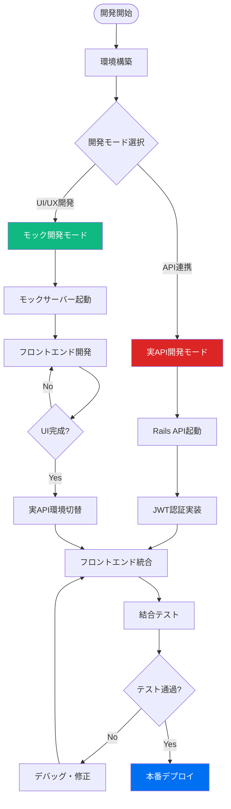
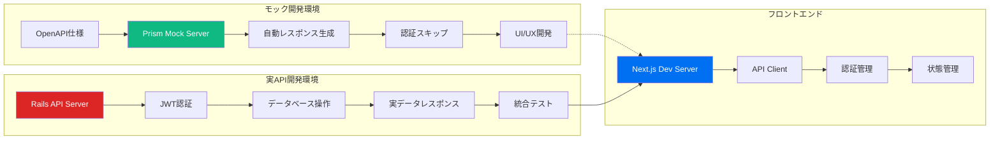
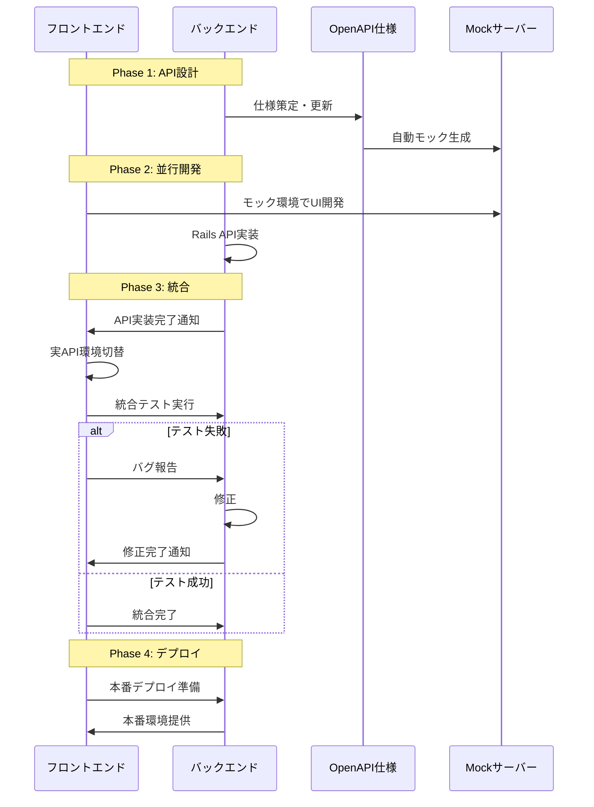
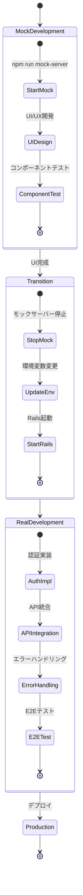

# Baby Log アプリケーション仕様書

## 📋 基本情報

| 項目 | 内容 |
|------|------|
| **アプリケーション名** | Baby Log - 育児記録アプリ |
| **バージョン** | 1.0.0 |
| **対象期間** | 新生児～幼児期（0歳～3歳） |
| **メインターゲット** | 夫婦・カップル |
| **リリース予定** | 2024年12月 |

## 🎯 プロダクト概要

### ビジョン
「育児の不安を解消し、夫婦で成長を見守るデジタルパートナー」

### ミッション
- 育児記録の簡素化とリアルタイム共有
- データに基づく成長の見える化
- 育児における夫婦間のコミュニケーション促進

### 解決する課題
1. **記録の煩雑さ**: 手書きメモや複数アプリの使い分けによる負担
2. **情報共有の遅れ**: パートナー間での記録の同期不足
3. **成長の把握困難**: 日々の変化を客観的に把握できない
4. **育児の孤立感**: 一人で抱え込みがちな育児への不安

## 👥 ユーザーペルソナ

### プライマリーペルソナ: 新米ママ（佐藤美咲、28歳）
- **背景**: 第一子出産、育児休暇中
- **課題**: 記録をつけたいが手間、夫との情報共有が不十分
- **ゴール**: 効率的な記録と夫婦での成長共有

### セカンダリーペルソナ: 働くパパ（佐藤健一、30歳）
- **背景**: 会社員、育児に積極的に参加したい
- **課題**: 日中の赤ちゃんの様子がわからない
- **ゴール**: 育児への参加感と妻のサポート

## 🔧 機能要件

### MVP機能（Phase 1）

#### 1. 認証・ユーザー管理
- **ユーザー登録・ログイン**
  - メールアドレス + パスワード認証
  - JWT トークンベース認証
  - パスワードリセット機能

- **プロフィール管理**
  - 表示名、アバター画像設定
  - タイムゾーン設定

#### 2. パートナーシップ機能
- **パートナー招待**
  - 招待コード/QRコード生成
  - メール招待機能
  - 承認・拒否システム

- **パートナー管理**
  - パートナー情報表示
  - 接続解除機能

#### 3. 基本記録機能
- **ミルク記録**
  - 時刻、量（ml）、種類（母乳/粉ミルク/混合）
  - メモ追加機能

- **おむつ記録**
  - 時刻、種類（うんち/おしっこ/両方）
  - 状態（色、硬さ、量）のメモ

- **睡眠記録**
  - 開始・終了時刻
  - 睡眠の質（良い/普通/悪い）
  - 場所（ベッド/抱っこ/ベビーカー等）

- **体重・身長記録**
  - 測定日時、体重（g）、身長（cm）
  - 頭囲、胸囲（オプション）

#### 4. 記録表示・管理
- **今日の記録一覧**
  - 時系列での記録表示
  - 記録種別でのフィルタリング
  - 記録の編集・削除

- **記録検索**
  - 日付範囲指定
  - 記録タイプ別絞り込み

#### 5. 基本統計表示
- **日別サマリー**
  - その日の記録回数
  - 睡眠時間合計
  - ミルク総量

- **週間トレンド**
  - 体重増加グラフ
  - 睡眠パターン
  - 授乳間隔

### 拡張機能（Phase 2）

#### 6. 高度な分析機能
- **成長曲線**
  - WHOガイドライン準拠
  - パーセンタイル表示
  - 成長予測

- **パターン分析**
  - 睡眠サイクル解析
  - 授乳パターン解析
  - ぐずりタイミング予測

#### 7. 通知・アラート機能
- **記録通知**
  - パートナーの記録更新通知
  - 定期記録リマインダー

- **健康アラート**
  - 異常値検知（体重減少等）
  - 記録忘れ通知

#### 8. エクスポート・共有機能
- **データエクスポート**
  - PDF レポート生成
  - CSV データダウンロード

- **医師共有**
  - 成長レポート生成
  - QR コードでの一時共有

## 📱 ユーザーインターフェース設計

### 画面構成

#### メイン画面（ダッシュボード）
```
┌─────────────────────────────────┐
│ 🍼 Baby Log        👤 Profile │
├─────────────────────────────────┤
│ 📅 Today: 2024/08/15           │
│                                 │
│ ⏰ 最新記録                    │
│ 🍼 15:30 ミルク 120ml          │
│ 💤 14:00-15:15 お昼寝          │
│                                 │
│ 📊 今日のサマリー              │
│ ├ ミルク: 5回 (600ml)          │
│ ├ おむつ: 3回                  │
│ └ 睡眠: 12時間                 │
│                                 │
│ ➕ クイック記録                │
│ [🍼] [👶] [💤] [📏]            │
└─────────────────────────────────┘
```

#### 記録入力画面
```
┌─────────────────────────────────┐
│ ← ミルク記録                   │
├─────────────────────────────────┤
│ 📅 日時                        │
│ [2024/08/15] [15:30]           │
│                                 │
│ 🍼 種類                        │
│ ◉ 母乳  ○ 粉ミルク  ○ 混合   │
│                                 │
│ 💧 量 (ml)                     │
│ [120        ]                   │
│                                 │
│ 📝 メモ                        │
│ [よく飲んでくれました]          │
│                                 │
│ [     保存     ]               │
└─────────────────────────────────┘
```

### デザインシステム

#### カラーパレット
- **プライマリー**: #4F8EF2 (爽やかなブルー)
- **セカンダリー**: #FFB84D (温かなオレンジ)
- **アクセント**: #FF6B9D (優しいピンク)
- **ニュートラル**: #F8F9FA, #6C757D, #212529

#### フォント
- **見出し**: 游ゴシック Bold
- **本文**: 游ゴシック Regular
- **数値**: SF Mono / Consolas

#### コンポーネント
- **ボタン**: 角丸8px、ドロップシャドウ付き
- **カード**: 角丸12px、境界線グレー
- **アイコン**: Material Design Icons 使用

## 🏗 技術仕様

### システムアーキテクチャ

#### フロントエンド
- **フレームワーク**: Next.js 15.4.6 (App Router)
- **言語**: TypeScript 5.8.3
- **スタイリング**: Styled Components 6.1.0
- **状態管理**: React Context + useState/useReducer
- **API通信**: Axios 1.7.0
- **バリデーション**: Zod 3.23.0

#### バックエンド
- **フレームワーク**: Ruby on Rails 7.1.5 (API mode)
- **言語**: Ruby 3.2.0
- **認証**: Devise + JWT
- **データベース**: PostgreSQL 15+
- **API仕様**: OpenAPI 3.0

#### インフラ
- **開発環境**: Docker Compose
- **本番環境**: 
  - フロント: Vercel
  - バック: Railway/Render
  - DB: PostgreSQL (managed service)

### API設計

#### エンドポイント構成
```
GET    /                     # ヘルスチェック
POST   /api/auth/register    # ユーザー登録
POST   /api/auth/login       # ログイン
DELETE /api/auth/logout      # ログアウト
GET    /api/auth/me          # 認証ユーザー情報

GET    /api/users/profile    # プロフィール取得
PUT    /api/users/profile    # プロフィール更新

GET    /api/records          # 記録一覧取得
POST   /api/records          # 記録作成
GET    /api/records/:id      # 記録詳細取得
PUT    /api/records/:id      # 記録更新
DELETE /api/records/:id      # 記録削除

GET    /api/partnerships     # パートナーシップ一覧
POST   /api/partnerships     # パートナー招待
PUT    /api/partnerships/:id # 招待承認/拒否
```

#### データモデル

##### Users テーブル
```sql
CREATE TABLE users (
  id BIGSERIAL PRIMARY KEY,
  email VARCHAR(255) NOT NULL UNIQUE,
  display_name VARCHAR(100) NOT NULL,
  avatar_url TEXT,
  timezone VARCHAR(50) DEFAULT 'Asia/Tokyo',
  created_at TIMESTAMP NOT NULL,
  updated_at TIMESTAMP NOT NULL
);
```

##### Partnerships テーブル
```sql
CREATE TABLE partnerships (
  id BIGSERIAL PRIMARY KEY,
  user1_id BIGINT NOT NULL REFERENCES users(id),
  user2_id BIGINT NOT NULL REFERENCES users(id),
  status VARCHAR(20) NOT NULL DEFAULT 'pending',
  invitation_token VARCHAR(255),
  invited_at TIMESTAMP,
  accepted_at TIMESTAMP,
  created_at TIMESTAMP NOT NULL,
  updated_at TIMESTAMP NOT NULL,
  
  CONSTRAINT check_different_users CHECK (user1_id != user2_id),
  CONSTRAINT check_status CHECK (status IN ('pending', 'accepted', 'declined'))
);
```

##### Records テーブル
```sql
CREATE TABLE records (
  id BIGSERIAL PRIMARY KEY,
  user_id BIGINT NOT NULL REFERENCES users(id),
  type VARCHAR(20) NOT NULL,
  recorded_at TIMESTAMP NOT NULL,
  metadata JSONB NOT NULL DEFAULT '{}',
  created_at TIMESTAMP NOT NULL,
  updated_at TIMESTAMP NOT NULL,
  
  CONSTRAINT check_type CHECK (type IN ('milk', 'diaper', 'sleep', 'vaccination', 'growth'))
);

-- インデックス
CREATE INDEX idx_records_user_type_date ON records(user_id, type, recorded_at);
CREATE INDEX idx_records_metadata ON records USING GIN(metadata);
```

#### JSON スキーマ

##### ミルク記録
```json
{
  "type": "milk",
  "metadata": {
    "amount_ml": 120,
    "milk_type": "formula", // "breast", "formula", "mixed"
    "duration_minutes": 15,
    "note": "よく飲んでくれました"
  }
}
```

##### おむつ記録
```json
{
  "type": "diaper",
  "metadata": {
    "diaper_type": "both", // "pee", "poop", "both"
    "condition": "normal", // "normal", "loose", "hard"
    "color": "yellow",
    "note": "いつもより量が多め"
  }
}
```

##### 睡眠記録
```json
{
  "type": "sleep",
  "metadata": {
    "start_time": "2024-08-15T14:00:00Z",
    "end_time": "2024-08-15T15:15:00Z",
    "duration_minutes": 75,
    "quality": "good", // "good", "normal", "poor"
    "location": "crib", // "crib", "arms", "stroller"
    "note": "静かに眠っていました"
  }
}
```

##### 成長記録
```json
{
  "type": "growth",
  "metadata": {
    "weight_g": 4500,
    "height_cm": 52.5,
    "head_circumference_cm": 38.0,
    "chest_circumference_cm": 36.0,
    "note": "順調な成長"
  }
}
```

## 🔒 セキュリティ要件

### 認証・認可
- JWT トークンによる認証
- リフレッシュトークンによる自動更新
- トークン有効期限: 1時間（リフレッシュ: 30日）

### データ保護
- HTTPS通信の強制
- パスワードのハッシュ化（bcrypt）
- 個人情報の暗号化保存

### プライバシー
- パートナー以外からのデータアクセス禁止
- データ削除権（GDPR準拠）
- 匿名化によるデータ分析

## 📊 非機能要件

### パフォーマンス
- **ページ読み込み時間**: < 3秒
- **API レスポンス時間**: < 500ms
- **同時ユーザー数**: 1,000ユーザー対応

### 可用性
- **アップタイム**: 99.5%以上
- **データバックアップ**: 日次自動バックアップ
- **災害復旧**: RTO 4時間、RPO 1時間

### 拡張性
- **ユーザー増**: 10,000ユーザーまで対応
- **データ増**: 100万レコードまで対応
- **機能追加**: プラグイン型アーキテクチャ

### 互換性
- **ブラウザ**: Chrome, Safari, Firefox (最新2バージョン)
- **モバイル**: iOS Safari, Android Chrome
- **PWA対応**: オフライン機能、プッシュ通知

## 🎨 ユーザーエクスペリエンス

### ユーザビリティ原則
1. **シンプルさ**: 3タップ以内で記録完了
2. **直感性**: アイコンによる視覚的操作
3. **高速性**: ローディング時間の最小化
4. **エラー防止**: バリデーションとガイダンス

### アクセシビリティ
- WCAG 2.1 AA レベル準拠
- スクリーンリーダー対応
- キーボードナビゲーション
- コントラスト比 4.5:1 以上

### モバイルファースト
- レスポンシブデザイン
- タッチ操作最適化
- PWA機能（インストール可能）
- オフライン閲覧機能

## 🧪 テスト戦略

### テストピラミッド
- **単体テスト**: 70% カバレッジ
- **統合テスト**: API エンドポイント全体
- **E2Eテスト**: 主要ユーザーフロー

### テストツール
- **フロント**: Jest + React Testing Library
- **バック**: RSpec + FactoryBot
- **E2E**: Playwright

### 品質ゲート
- テストカバレッジ > 80%
- すべてのテストが通過
- TypeScript エラー 0件
- ESLint エラー 0件

## 🛠 開発フロー

### 開発環境の特徴

Baby Logの開発環境では、**モックサーバー**を使用してフロントエンド開発を効率化しています。

### 開発フロー全体図



### 環境別開発フロー



#### モックサーバーの特徴
- **Prism** を使用したOpenAPI仕様ベースのモック
- **認証スキップ**: JWT Bearer認証をバイパス
- **自動レスポンス生成**: スキーマに基づく一貫したダミーデータ
- **バリデーション**: リクエスト/レスポンスの形式チェック

### 開発モード比較

| 項目 | モック開発 | 実API開発 |
|------|------------|-----------|
| **認証** | 不要（スキップ） | JWT必須 |
| **データ** | 自動生成 | 実データ |
| **起動コマンド** | `npm run mock-server` | Rails サーバー |
| **ポート** | 3001 | 3001 |
| **用途** | UI/UX開発 | API連携テスト |

### フロントエンド開発手順

#### 1. モック開発での作業フロー

```bash
# 1. モックサーバー起動
cd frontend
npm run mock-server

# 2. フロントエンド開発サーバー起動
npm run dev

# アクセス
# Frontend: http://localhost:3000
# Mock API: http://localhost:3001
```

**モック開発時の注意点:**
- ✅ 認証ヘッダーは不要（自動で認証済み扱い）
- ✅ レスポンスデータは毎回同じ（決定論的）
- ⚠️ データの永続化なし（再起動で初期化）
- ⚠️ エラーレスポンスは限定的

#### 2. 実API開発での作業フロー

```bash
# 1. バックエンド起動（別ターミナル）
cd backend
rails server -p 3001

# 2. フロントエンド起動
cd frontend
npm run dev
```

**実API開発時の注意点:**
- 🔐 JWT認証が必須
- 📊 実際のデータベース操作
- 🐛 詳細なエラーハンドリングが必要
- 🔄 データの永続化

### 開発時の切り替えポイント

#### モック → 実API への切り替えタイミング
1. **UI コンポーネント完成後**
2. **データフロー設計完了後**
3. **バックエンドAPI実装完了後**
4. **エラーハンドリング実装時**

#### 環境変数での切り替え

```bash
# frontend/.env.local

# モック開発時
NEXT_PUBLIC_API_URL=http://localhost:3001
NEXT_PUBLIC_USE_MOCK=true

# 実API開発時
NEXT_PUBLIC_API_URL=http://localhost:3001
NEXT_PUBLIC_USE_MOCK=false
```

### 認証フローの開発

#### モック環境での認証開発
```typescript
// lib/auth.ts (モック用)
export const mockAuthProvider = {
  // 常に認証済みとして扱う
  isAuthenticated: () => true,
  getToken: () => 'mock-jwt-token',
  login: async () => ({ token: 'mock-jwt-token' }),
  logout: () => { /* no-op */ }
};
```

#### 実環境での認証開発
```typescript
// lib/auth.ts (実装用)
export const authProvider = {
  isAuthenticated: () => !!localStorage.getItem('token'),
  getToken: () => localStorage.getItem('token'),
  login: async (credentials) => {
    const response = await api.post('/api/auth/login', credentials);
    localStorage.setItem('token', response.data.token);
    return response.data;
  },
  logout: () => localStorage.removeItem('token')
};
```

### API通信の実装パターン

#### 開発環境を意識したAPI Client

```typescript
// lib/api.ts
import axios from 'axios';

const api = axios.create({
  baseURL: process.env.NEXT_PUBLIC_API_URL,
});

// モック環境では認証ヘッダーをスキップ
api.interceptors.request.use((config) => {
  if (process.env.NEXT_PUBLIC_USE_MOCK !== 'true') {
    const token = localStorage.getItem('token');
    if (token) {
      config.headers.Authorization = `Bearer ${token}`;
    }
  }
  return config;
});

// エラーハンドリング（実API時のみ）
api.interceptors.response.use(
  (response) => response,
  (error) => {
    if (process.env.NEXT_PUBLIC_USE_MOCK !== 'true' && error.response?.status === 401) {
      // 自動ログアウト処理
      localStorage.removeItem('token');
      window.location.href = '/login';
    }
    return Promise.reject(error);
  }
);
```

### テストデータの管理

#### モック環境でのテストデータ
```json
// テストユーザー（Prismが自動生成）
{
  "id": 1,
  "email": "test@example.com",
  "display_name": "Test User"
}

// テスト記録データ
{
  "id": 1,
  "type": "milk",
  "recorded_at": "2024-08-15T10:30:00Z",
  "metadata": {
    "amount_ml": 120,
    "milk_type": "formula"
  }
}
```

### デバッグとトラブルシューティング

#### 開発環境診断コマンド
```bash
# モックサーバーの動作確認
curl http://localhost:3001/

# API レスポンス確認
curl -H "Content-Type: application/json" \
     http://localhost:3001/api/records

# バリデーション付きモック起動
npm run mock-server:validate
```

#### よくある問題と解決策

1. **認証エラーが発生する**
   ```bash
   # 解決: モック環境の確認
   echo $NEXT_PUBLIC_USE_MOCK
   # または環境変数を設定
   export NEXT_PUBLIC_USE_MOCK=true
   ```

2. **データが期待通りでない**
   ```bash
   # 解決: OpenAPI仕様の確認
   # api/openapi.yaml のschemaをチェック
   ```

3. **CORS エラー**
   ```bash
   # 解決: モックサーバーのCORS設定
   npm run mock-server -- --cors
   ```

### 開発チーム向けガイドライン

#### フロントエンド開発者
1. **初期開発**: モック環境でUI実装
2. **データ連携**: API仕様に基づく型定義作成
3. **統合テスト**: 実API環境での動作確認

#### バックエンド開発者
1. **API設計**: OpenAPI仕様の更新
2. **実装**: Rails APIの開発
3. **テスト**: フロントエンドとの結合テスト

#### 協働のポイント
- **仕様変更**: OpenAPI更新 → モック再起動
- **データ形式**: JSON Schema の厳密な定義
- **エラーケース**: 実API でのテストを重視

### チーム開発ワークフロー



### 機能開発のライフサイクル

```mermaid
gitgraph
    commit id: "初期設定"
    branch feature/records-ui
    checkout feature/records-ui
    commit id: "モック環境構築"
    commit id: "UI コンポーネント開発"
    commit id: "データフロー実装"
    
    checkout main
    branch feature/records-api
    checkout feature/records-api
    commit id: "OpenAPI仕様更新"
    commit id: "Rails API実装"
    commit id: "テストケース作成"
    
    checkout feature/records-ui
    merge feature/records-api
    commit id: "実API統合テスト"
    commit id: "エラーハンドリング"
    
    checkout main
    merge feature/records-ui
    commit id: "機能完成・リリース"
```

### 環境切り替えワークフロー



## 📈 開発計画

### Phase 1: MVP (8週間)
- Week 1-2: 環境構築、認証機能
- Week 3-4: 基本記録機能
- Week 5-6: パートナーシップ機能
- Week 7-8: UI/UX調整、テスト

### Phase 2: 機能拡張 (6週間)
- Week 9-10: 統計・分析機能
- Week 11-12: 通知機能
- Week 13-14: エクスポート機能

### Phase 3: 最適化 (4週間)
- Week 15-16: パフォーマンス改善
- Week 17-18: 本番デプロイ、運用開始

## 📋 成功指標

### ビジネス指標
- **DAU**: 500ユーザー（3ヶ月後）
- **継続率**: 7日後 60%、30日後 30%
- **NPS**: 50以上

### 技術指標
- **可用性**: 99.5%以上
- **レスポンス時間**: 平均 200ms以下
- **エラー率**: 0.1%以下

### ユーザー満足度
- **記録完了率**: 90%以上
- **記録頻度**: 1日平均 8回
- **パートナー利用率**: 80%以上

---

**Document Version**: 1.0  
**Last Updated**: 2024-08-15  
**Author**: Baby Log Development Team