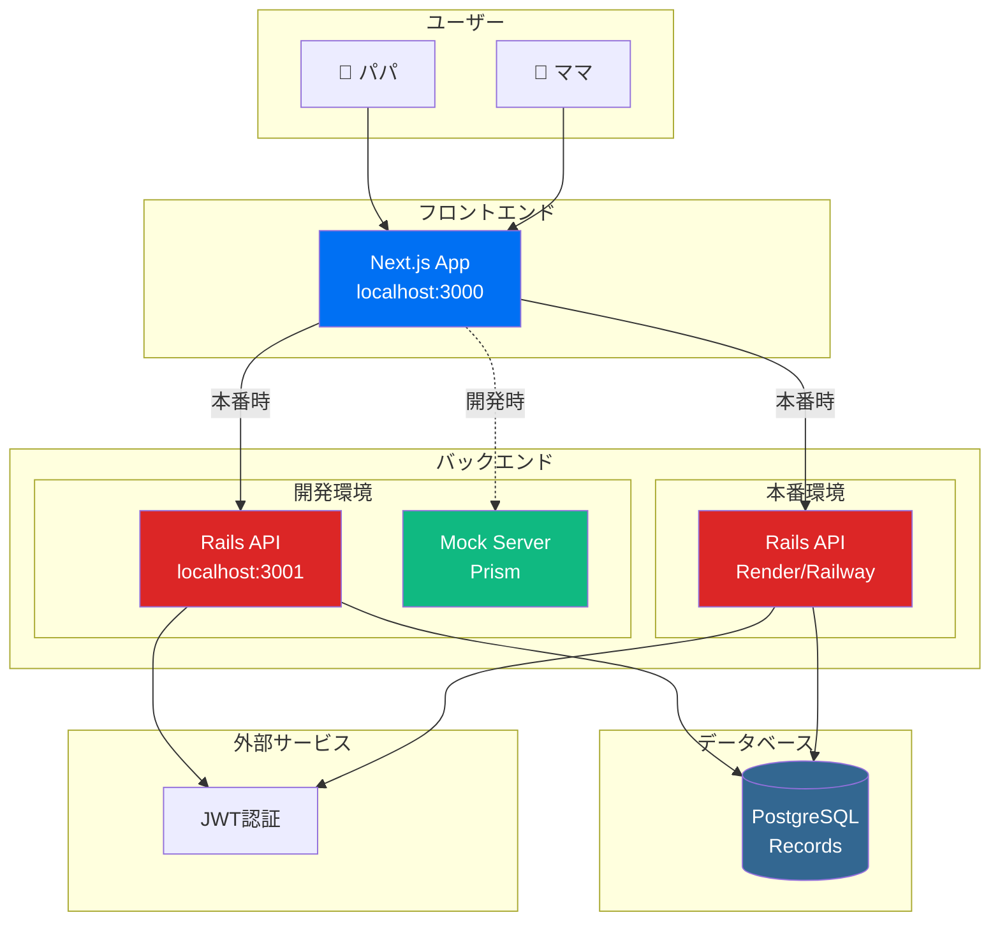

# Baby Log アプリケーション仕様書（修正版）

## 📋 基本情報

| 項目 | 内容 |
|------|------|
| **アプリケーション名** | Baby Log - 育児記録アプリ |
| **バージョン** | 1.0.0 |
| **対象期間** | 新生児～幼児期（0歳～3歳） |
| **メインターゲット** | 夫婦・カップル（共有アカウント） |
| **リリース予定** | 2024年12月 |

## 🎯 プロダクト概要

### ビジョン
「育児の不安を解消し、夫婦で成長を見守るデジタルパートナー」

### ミッション
- 育児記録の簡素化と一元管理
- データに基づく成長の見える化
- 夫婦間での育児情報の共有促進

### 解決する課題
1. **記録の煩雑さ**: 手書きメモや複数アプリの使い分けによる負担
2. **情報共有の遅れ**: 夫婦間での記録の非同期化
3. **成長の把握困難**: 日々の変化を客観的に把握できない
4. **育児の孤立感**: 一人で抱え込みがちな育児への不安

## 👥 ユーザーペルソナ

### プライマリーペルソナ: 新米ママ（佐藤美咲、28歳）
- **背景**: 第一子出産、育児休暇中
- **課題**: 記録をつけたいが手間、夫との情報共有が不十分
- **ゴール**: 効率的な記録と夫婦での成長共有

### セカンダリーペルソナ: 働くパパ（佐藤健一、30歳）
- **背景**: 会社員、育児に積極的に参加したい
- **課題**: 日中の赤ちゃんの様子がわからない
- **ゴール**: 育児への参加感と妻のサポート

### 共有アカウントの利用シーン
- **朝**: ママが授乳記録を入力
- **昼**: パパが帰宅後、同じアカウントで一日の記録を確認
- **夜**: パパがお風呂後の記録を追加
- **定期**: 夫婦で一緒に成長グラフを確認

## 🔧 機能要件

### MVP機能（Phase 1）

#### 1. 認証・ユーザー管理
- **ユーザー登録・ログイン**
  - メールアドレス + パスワード認証
  - JWT トークンベース認証
  - パスワードリセット機能

- **プロフィール管理**
  - 赤ちゃんの名前、誕生日設定
  - アバター画像設定
  - タイムゾーン設定

#### 2. 基本記録機能
- **ミルク記録**
  - 時刻、量（ml）、種類（母乳/粉ミルク/混合）
  - 担当者（ママ/パパ）の記録
  - メモ追加機能

- **おむつ記録**
  - 時刻、種類（うんち/おしっこ/両方）
  - 状態（色、硬さ、量）のメモ
  - 担当者の記録

- **睡眠記録**
  - 開始・終了時刻
  - 睡眠の質（良い/普通/悪い）
  - 場所（ベッド/抱っこ/ベビーカー等）

- **体重・身長記録**
  - 測定日時、体重（g）、身長（cm）
  - 頭囲、胸囲（オプション）

#### 3. 記録表示・管理
- **今日の記録一覧**
  - 時系列での記録表示
  - 記録種別でのフィルタリング
  - 担当者別での記録確認
  - 記録の編集・削除

- **記録検索**
  - 日付範囲指定
  - 記録タイプ別絞り込み
  - 担当者別絞り込み

#### 4. 基本統計表示
- **日別サマリー**
  - その日の記録回数
  - 睡眠時間合計
  - ミルク総量
  - 担当者別の記録数

- **週間トレンド**
  - 体重増加グラフ
  - 睡眠パターン
  - 授乳間隔

### 拡張機能（Phase 2）

#### 5. 高度な分析機能
- **成長曲線**
  - WHOガイドライン準拠
  - パーセンタイル表示
  - 成長予測

- **パターン分析**
  - 睡眠サイクル解析
  - 授乳パターン解析
  - ぐずりタイミング予測

#### 6. アラート機能
- **健康アラート**
  - 異常値検知（体重減少等）
  - 記録忘れ通知

#### 7. エクスポート・共有機能
- **データエクスポート**
  - PDF レポート生成
  - CSV データダウンロード

- **医師共有**
  - 成長レポート生成
  - QR コードでの一時共有

## 📱 ユーザーインターフェース設計

### 画面構成

#### メイン画面（ダッシュボード）
```
┌─────────────────────────────────┐
│ 🍼 Baby Log        👤 Profile │
├─────────────────────────────────┤
│ 📅 Today: 2024/08/15           │
│ 👶 さくらちゃん（生後45日）    │
│                                 │
│ ⏰ 最新記録                    │
│ 🍼 15:30 ミルク 120ml by ママ   │
│ 💤 14:00-15:15 お昼寝          │
│                                 │
│ 📊 今日のサマリー              │
│ ├ ミルク: 5回 (600ml)          │
│ ├ おむつ: 3回                  │
│ ├ 睡眠: 12時間                 │
│ └ 担当: ママ 7回, パパ 3回      │
│                                 │
│ ➕ クイック記録                │
│ [🍼] [👶] [💤] [📏]            │
└─────────────────────────────────┘
```

#### 記録入力画面
```
┌─────────────────────────────────┐
│ ← ミルク記録                   │
├─────────────────────────────────┤
│ 📅 日時                        │
│ [2024/08/15] [15:30]           │
│                                 │
│ 👤 担当者                       │
│ ◉ ママ  ○ パパ                │
│                                 │
│ 🍼 種類                        │
│ ◉ 母乳  ○ 粉ミルク  ○ 混合   │
│                                 │
│ 💧 量 (ml)                     │
│ [120        ]                   │
│                                 │
│ 📝 メモ                        │
│ [よく飲んでくれました]          │
│                                 │
│ [     保存     ]               │
└─────────────────────────────────┘
```

## 🏗 技術仕様

### システムアーキテクチャ



#### フロントエンド
- **フレームワーク**: Next.js 15.4.6 (App Router)
- **言語**: TypeScript 5.8.3
- **スタイリング**: Styled Components 6.1.0
- **状態管理**: React Context + useState/useReducer
- **API通信**: Axios 1.7.0
- **バリデーション**: Zod 3.23.0

#### バックエンド
- **フレームワーク**: Ruby on Rails 7.1.5 (API mode)
- **言語**: Ruby 3.2.0
- **認証**: Devise + JWT
- **データベース**: PostgreSQL 15+
- **API仕様**: OpenAPI 3.0

### API設計

#### エンドポイント構成
```
GET    /                     # ヘルスチェック
POST   /api/auth/register    # ユーザー登録
POST   /api/auth/login       # ログイン
DELETE /api/auth/logout      # ログアウト
GET    /api/auth/me          # 認証ユーザー情報

GET    /api/users/profile    # プロフィール取得
PUT    /api/users/profile    # プロフィール更新

GET    /api/records          # 記録一覧取得
POST   /api/records          # 記録作成
GET    /api/records/:id      # 記録詳細取得
PUT    /api/records/:id      # 記録更新
DELETE /api/records/:id      # 記録削除
```

#### データモデル

##### Users テーブル
```sql
CREATE TABLE users (
  id BIGSERIAL PRIMARY KEY,
  email VARCHAR(255) NOT NULL UNIQUE,
  display_name VARCHAR(100) NOT NULL,
  baby_name VARCHAR(100),
  baby_birthday DATE,
  avatar_url TEXT,
  timezone VARCHAR(50) DEFAULT 'Asia/Tokyo',
  created_at TIMESTAMP NOT NULL,
  updated_at TIMESTAMP NOT NULL
);
```

##### Records テーブル
```sql
CREATE TABLE records (
  id BIGSERIAL PRIMARY KEY,
  user_id BIGINT NOT NULL REFERENCES users(id),
  type VARCHAR(20) NOT NULL,
  recorded_at TIMESTAMP NOT NULL,
  recorded_by VARCHAR(20) DEFAULT 'unknown', -- 'mama', 'papa', 'unknown'
  metadata JSONB NOT NULL DEFAULT '{}',
  created_at TIMESTAMP NOT NULL,
  updated_at TIMESTAMP NOT NULL,
  
  CONSTRAINT check_type CHECK (type IN ('milk', 'diaper', 'sleep', 'vaccination', 'growth')),
  CONSTRAINT check_recorded_by CHECK (recorded_by IN ('mama', 'papa', 'unknown'))
);

-- インデックス
CREATE INDEX idx_records_user_type_date ON records(user_id, type, recorded_at);
CREATE INDEX idx_records_recorded_by ON records(user_id, recorded_by, recorded_at);
CREATE INDEX idx_records_metadata ON records USING GIN(metadata);
```

#### JSON スキーマ

##### ミルク記録
```json
{
  "type": "milk",
  "recorded_by": "mama",
  "metadata": {
    "amount_ml": 120,
    "milk_type": "formula", // "breast", "formula", "mixed"
    "duration_minutes": 15,
    "note": "よく飲んでくれました"
  }
}
```

##### おむつ記録
```json
{
  "type": "diaper",
  "recorded_by": "papa",
  "metadata": {
    "diaper_type": "both", // "pee", "poop", "both"
    "condition": "normal", // "normal", "loose", "hard"
    "color": "yellow",
    "note": "いつもより量が多め"
  }
}
```

##### 睡眠記録
```json
{
  "type": "sleep",
  "recorded_by": "mama",
  "metadata": {
    "start_time": "2024-08-15T14:00:00Z",
    "end_time": "2024-08-15T15:15:00Z",
    "duration_minutes": 75,
    "quality": "good", // "good", "normal", "poor"
    "location": "crib", // "crib", "arms", "stroller"
    "note": "静かに眠っていました"
  }
}
```

##### 成長記録
```json
{
  "type": "growth",
  "recorded_by": "papa",
  "metadata": {
    "weight_g": 4500,
    "height_cm": 52.5,
    "head_circumference_cm": 38.0,
    "chest_circumference_cm": 36.0,
    "note": "順調な成長"
  }
}
```

## 🔒 セキュリティ要件

### 認証・認可
- JWT トークンによる認証
- リフレッシュトークンによる自動更新
- トークン有効期限: 1時間（リフレッシュ: 30日）

### データ保護
- HTTPS通信の強制
- パスワードのハッシュ化（bcrypt）
- 個人情報の暗号化保存

### プライバシー
- アカウント所有者以外からのデータアクセス禁止
- データ削除権（GDPR準拠）
- 匿名化によるデータ分析

## 📊 非機能要件

### パフォーマンス
- **ページ読み込み時間**: < 3秒
- **API レスポンス時間**: < 500ms
- **同時ユーザー数**: 1,000ユーザー対応

### 可用性
- **アップタイム**: 99.5%以上
- **データバックアップ**: 日次自動バックアップ
- **災害復旧**: RTO 4時間、RPO 1時間

### 拡張性
- **ユーザー増**: 10,000ユーザーまで対応
- **データ増**: 100万レコードまで対応
- **機能追加**: プラグイン型アーキテクチャ

### 互換性
- **ブラウザ**: Chrome, Safari, Firefox (最新2バージョン)
- **モバイル**: iOS Safari, Android Chrome
- **PWA対応**: オフライン機能、インストール可能

## 🎨 ユーザーエクスペリエンス

### ユーザビリティ原則
1. **シンプルさ**: 3タップ以内で記録完了
2. **直感性**: アイコンによる視覚的操作
3. **高速性**: ローディング時間の最小化
4. **エラー防止**: バリデーションとガイダンス

### アクセシビリティ
- WCAG 2.1 AA レベル準拠
- スクリーンリーダー対応
- キーボードナビゲーション
- コントラスト比 4.5:1 以上

### モバイルファースト
- レスポンシブデザイン
- タッチ操作最適化
- PWA機能（インストール可能）
- オフライン閲覧機能

## 🧪 テスト戦略

### テストピラミッド
- **単体テスト**: 70% カバレッジ
- **統合テスト**: API エンドポイント全体
- **E2Eテスト**: 主要ユーザーフロー

### テストツール
- **フロント**: Jest + React Testing Library
- **バック**: RSpec + FactoryBot
- **E2E**: Playwright

### 品質ゲート
- テストカバレッジ > 80%
- すべてのテストが通過
- TypeScript エラー 0件
- ESLint エラー 0件

## 📈 開発計画

### Phase 1: MVP (6週間)
- Week 1-2: 環境構築、認証機能
- Week 3-4: 基本記録機能
- Week 5-6: UI/UX調整、テスト

### Phase 2: 機能拡張 (4週間)
- Week 7-8: 統計・分析機能
- Week 9-10: エクスポート機能

### Phase 3: 最適化 (2週間)
- Week 11-12: パフォーマンス改善、本番デプロイ

## 📋 成功指標

### ビジネス指標
- **DAU**: 500ユーザー（3ヶ月後）
- **継続率**: 7日後 60%、30日後 30%
- **NPS**: 50以上

### 技術指標
- **可用性**: 99.5%以上
- **レスポンス時間**: 平均 200ms以下
- **エラー率**: 0.1%以下

### ユーザー満足度
- **記録完了率**: 90%以上
- **記録頻度**: 1日平均 8回
- **担当者記録率**: ママ60%, パパ40%

---

## 💡 主な変更点

### 削除された機能
1. **パートナーシップ機能**
   - パートナー招待システム
   - 承認・拒否機能
   - パートナー管理画面

2. **通知機能**
   - パートナーの記録更新通知
   - リアルタイム同期
   - プッシュ通知

3. **複雑な共有機能**
   - 別アカウント間の連携
   - リアルタイムデータ同期

### 追加・修正された機能
1. **担当者記録**
   - 各記録に担当者（ママ/パパ）を追加
   - 担当者別の統計表示

2. **シンプルな共有**
   - 同一アカウント内での記録共有
   - 担当者別フィルタリング

3. **プロフィール強化**
   - 赤ちゃんの基本情報設定
   - より詳細な設定管理

### アーキテクチャの簡素化
- Partnershipsテーブルの削除
- 通知関連APIの削除
- リアルタイム機能の削除
- より軽量でシンプルな構成

---

**Document Version**: 2.0 (Revised)  
**Last Updated**: 2024-08-15  
**Author**: Baby Log Development Team