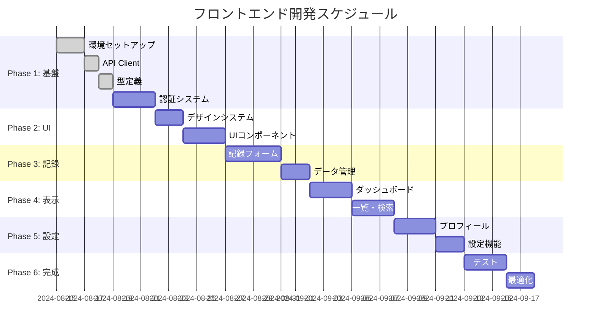

# Baby Log フロントエンド開発タスク

## 📋 プロジェクト概要

**目標**: Baby Log アプリケーションのフロントエンド開発
**期間**: 6週間（Phase 1 MVP）
**技術スタック**: Next.js 15.4.6, TypeScript, Tailwind CSS + Styled Components, Axios

## 🏗 現在の構造分析

### ✅ 既存リソース
- Next.js App Router 構成完了
- TypeScript設定済み
- Styled Components設定済み
- 基本UIコンポーネント（Button, Card, Input, Skeleton）
- Storybook設定済み
- 基本的なディレクトリ構造

### 📂 アーキテクチャ
```
src/
├── app/              # Next.js App Router
├── components/       # 再利用可能UIコンポーネント
├── contexts/        # React Context（認証、記録）
├── features/        # 機能別コード
├── hooks/           # カスタムフック
├── lib/             # ユーティリティ・設定
└── styles/          # テーマ・スタイル（Tailwind設定含む）
```

### 🎨 スタイリング戦略
- **サーバーコンポーネント**: Tailwind CSS
- **クライアントコンポーネント**: Styled Components
- **設計原則**: コンポーネントタイプに応じた適切な手法選択

## 🎯 開発タスク一覧

### Phase 1: 基盤・環境構築 (Week 1)

#### 1.1 開発環境セットアップ
- [ ] **Task 1.1.1**: 環境変数設定
  - `.env.local`ファイル作成
  - API URL、Mock設定の環境変数定義
  - **工数**: 0.5日

- [ ] **Task 1.1.2**: API Client セットアップ
  - Axios設定（`lib/api.ts`）
  - 認証ヘッダー自動付与
  - エラーハンドリング
  - **工数**: 1日

- [ ] **Task 1.1.3**: TypeScript型定義
  - API レスポンス型定義
  - 記録データ型定義
  - **工数**: 1日

- [ ] **Task 1.1.4**: モックサーバー連携
  - Prism Mock Server起動確認
  - API通信テスト
  - **工数**: 0.5日

#### 1.2 認証システム
- [ ] **Task 1.2.1**: 認証Context実装
  - `AuthContext`の本格実装
  - JWT トークン管理
  - **工数**: 1日

- [ ] **Task 1.2.2**: ログイン画面
  - ログインフォーム作成
  - バリデーション実装
  - **工数**: 1日

- [ ] **Task 1.2.3**: ユーザー登録画面
  - 登録フォーム作成
  - バリデーション実装
  - **工数**: 1日

### Phase 2: コアUIコンポーネント (Week 2)

#### 2.1 デザインシステム強化
- [ ] **Task 2.1.1**: Tailwind CSS導入・設定
  - Tailwind CSS インストール
  - `tailwind.config.ts`設定
  - カラーパレット・フォント定義
  - **工数**: 1日

- [ ] **Task 2.1.2**: アイコンシステム
  - 記録用アイコン追加（🍼👶💤📏）
  - SVGアイコンコンポーネント化
  - **工数**: 1日

- [ ] **Task 2.1.3**: 既存Styled Componentsの移行判定
  - サーバーコンポーネント対象をTailwindに移行
  - クライアントコンポーネントはStyledComponents維持
  - **工数**: 1日

#### 2.2 複合UIコンポーネント
- [ ] **Task 2.2.1**: QuickActionButton
  - ワンタップ記録ボタン
  - アイコン+ラベル表示
  - **工数**: 1日

- [ ] **Task 2.2.2**: RecordCard
  - 記録カード表示
  - 編集・削除アクション
  - **工数**: 1.5日

- [ ] **Task 2.2.3**: DatePicker
  - 日付選択コンポーネント
  - 時刻選択機能
  - **工数**: 1日

### Phase 3: 記録機能 (Week 3)

#### 3.1 記録入力フォーム
- [ ] **Task 3.1.1**: ミルク記録フォーム
  - 量、種類、担当者入力
  - バリデーション
  - **工数**: 1.5日

- [ ] **Task 3.1.2**: おむつ記録フォーム
  - 種類、状態、担当者入力
  - **工数**: 1日

- [ ] **Task 3.1.3**: 睡眠記録フォーム
  - 開始・終了時刻、質、場所
  - **工数**: 1.5日

- [ ] **Task 3.1.4**: 成長記録フォーム
  - 体重、身長、頭囲入力
  - **工数**: 1日

#### 3.2 記録データ管理
- [ ] **Task 3.2.1**: RecordsContext実装
  - 記録状態管理
  - CRUD操作
  - **工数**: 1日

- [ ] **Task 3.2.2**: カスタムフック
  - `useRecords`フック
  - API呼び出しロジック
  - **工数**: 1日

### Phase 4: ダッシュボード・一覧 (Week 4)

#### 4.1 メインダッシュボード
- [ ] **Task 4.1.1**: ダッシュボードレイアウト
  - 今日のサマリー表示
  - クイックアクションボタン配置
  - **工数**: 1.5日

- [ ] **Task 4.1.2**: 最新記録表示
  - 時系列記録一覧
  - 記録種別アイコン表示
  - **工数**: 1日

- [ ] **Task 4.1.3**: 今日の統計
  - 記録回数、総量表示
  - 担当者別統計
  - **工数**: 1.5日

#### 4.2 記録一覧・検索
- [ ] **Task 4.2.1**: 記録一覧画面
  - ページネーション
  - 記録カード表示
  - **工数**: 1.5日

- [ ] **Task 4.2.2**: フィルタリング機能
  - 日付範囲選択
  - 記録タイプ別絞り込み
  - 担当者別絞り込み
  - **工数**: 2日

### Phase 5: プロフィール・設定 (Week 5)

#### 5.1 ユーザープロフィール
- [ ] **Task 5.1.1**: プロフィール表示画面
  - ユーザー情報表示
  - 赤ちゃん情報表示
  - **工数**: 1日

- [ ] **Task 5.1.2**: プロフィール編集フォーム
  - 赤ちゃん名前、誕生日設定
  - アバター画像アップロード
  - **工数**: 2日

#### 5.2 設定機能
- [ ] **Task 5.2.1**: 設定画面
  - タイムゾーン設定
  - 通知設定（将来用）
  - **工数**: 1日

- [ ] **Task 5.2.2**: データエクスポート
  - CSV ダウンロード機能
  - PDF レポート生成
  - **工数**: 2日

### Phase 6: テスト・最適化 (Week 6)

#### 6.1 テスト実装
- [ ] **Task 6.1.1**: 単体テスト
  - コンポーネントテスト
  - フックテスト
  - **工数**: 2日

- [ ] **Task 6.1.2**: 統合テスト
  - ページ間遷移テスト
  - API統合テスト
  - **工数**: 1.5日

#### 6.2 パフォーマンス最適化
- [ ] **Task 6.2.1**: Bundle Size最適化
  - 未使用コード削除
  - Dynamic Import適用
  - **工数**: 1日

- [ ] **Task 6.2.2**: アクセシビリティ対応
  - ARIA属性追加
  - キーボードナビゲーション
  - **工数**: 1.5日

## 🔄 タスクの依存関係



## 📊 工数見積もり

| Phase | カテゴリ | 工数 | 優先度 |
|-------|----------|------|--------|
| 1 | 基盤・環境構築 | 5日 | 🔴 High |
| 2 | UIコンポーネント | 5日 | 🔴 High |
| 3 | 記録機能 | 6日 | 🔴 High |
| 4 | ダッシュボード | 6日 | 🟡 Medium |
| 5 | プロフィール・設定 | 5日 | 🟡 Medium |
| 6 | テスト・最適化 | 5日 | 🟢 Low |
| **合計** | | **32日** | |

## 🎯 優先度別実装順序

### 🔴 最優先（Week 1-3）
1. 認証システム
2. 基本記録機能（ミルク、おむつ、睡眠、成長）
3. シンプルな記録一覧表示

### 🟡 中優先（Week 4-5）
1. ダッシュボード
2. 統計表示
3. プロフィール管理

### 🟢 低優先（Week 6）
1. 詳細検索・フィルタリング
2. データエクスポート
3. パフォーマンス最適化

## 🧪 開発・テスト方針

### 開発環境
1. **モック開発**: UI/UX実装時
2. **実API統合**: 機能完成後
3. **環境切り替え**: 環境変数で制御

### テスト戦略
- **単体テスト**: 各コンポーネント
- **統合テスト**: ユーザーフロー
- **E2Eテスト**: 主要機能

### コード品質
- **TypeScript**: 型安全性
- **ESLint**: コード規約
- **Prettier**: コードフォーマット
- **Storybook**: コンポーネント開発

## 📝 実装ガイドライン

### ファイル命名規則
- **コンポーネント**: PascalCase (e.g., `RecordCard.tsx`)
- **フック**: camelCase with 'use' prefix (e.g., `useRecords.ts`)
- **ユーティリティ**: camelCase (e.g., `formatDate.ts`)

### ディレクトリ構造規則
- **機能別**: `features/records/`
- **共通UI**: `components/ui/`
- **ページ専用**: `components/pages/`

### コンポーネント設計原則
1. **単一責任**: 1つのコンポーネント = 1つの責任
2. **再利用性**: プロップスによる設定可能性
3. **テスタビリティ**: テスト容易性を考慮
4. **パフォーマンス**: 不要な再レンダリング防止

---

**Document Version**: 1.0  
**Last Updated**: 2024-08-15  
**Estimated Total**: 32 working days (6 weeks)